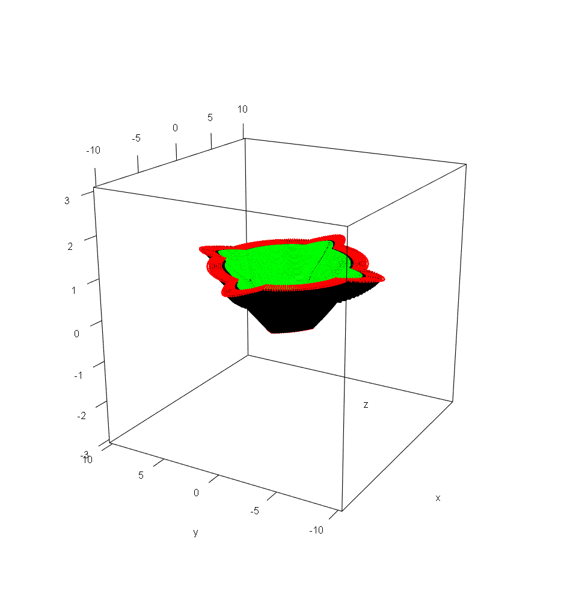

# Mortero Valenciano

El proyecto funciona haciendo uso de las librerías:

  - require(bezier)
  - require(rgl)
  - require(gridBezier)
  - require(plot3D)
  - require(magick)

# General

  - El archivo puede ser abierto y compilado sin dependencias o archivos externos
  - Genera un Mortero valenciado generado mediante algoritmos generados por GeoGebra e Illustrator


# Visualización

El proyecto se basa en la librería [Plot3D](https://cran.r-project.org/web/packages/plot3D/vignettes/plot3D.pdf) para graficar.

Para visualizar de manera interactiva el programa basta con ejecutar el codigo mediante el boton Run o directamente seleccionando todo el codigo y presionando la combinación de teclas Control + Enter.

Para ejecutar una visualización giratora ejecutar el codigo comentado:

```sh
play3d( spin3d( axis = c(0, 0, 1), rpm = 7), duration = 10 )
```

Para la verificación de Errores se implementa el siguiente codigo:

```sh
#-------------------------ERRORES-TAPA------------------------#

auxX = X[1:100] 

cat("X original","\t", "X tapa", "\t",  "\t", "error absoluto", "\t", "error relativo", "\n")

cont = 700
for (i in 1:100) {
  errorabs = round(abs(auxX[i]-X3[cont]),3)
  errorrel = round(errorabs/auxX[i],3)
  cat(round(auxX[i],3),"\t\t", round(X3[cont],3), "\t",  "\t\t", errorabs, "\t\t", errorrel, "\n")
  cont = cont+1
}


#-------------------------ERRORES-PARED EXTERNA------------------------#

auxX2 = X[1:100] 


cat("X original","\t", "X pared", "\t",  "\t", "error absoluto", "\t", "error relativo", "\n")

cont = 101
for (i in 1:100) {
  errorabs = round(abs(auxX2[i]-X[cont]),3)
  errorrel = round(errorabs/auxX2[i],3)
  cat(round(auxX2[i],3),"\t\t", round(X[cont],3), "\t",  "\t\t", errorabs, "\t\t", errorrel, "\n")
  cont = cont+1
}
```


